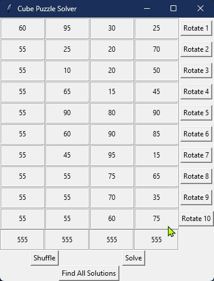

# Cube Puzzle Solver

Welcome to the Cube Puzzle Solver! This Python script is designed to solve a unique puzzle involving a tower of cubes, each with numbers on their faces. The goal of the puzzle is to rotate the cubes so that each column (representing one side of the tower) sums up to 555.



## Puzzle Description

- There are 10 cubes, each with 4 faces.
- Each face has a unique number.
- The cubes are stacked vertically to form a tower.
- The tower has 4 visible columns, one for each side of the cubes.
- The objective is to rotate the cubes such that the sum of the numbers on each side equals 555.

## Features

- A GUI for interactive puzzle solving.
- Functions to rotate cubes, shuffle the configuration, and check for a solution.
- An algorithm to find a solution by trying all possible combinations.
- A function to find and save all possible solutions to a text file.

## Usage

To use the Cube Puzzle Solver, simply run the script, and the GUI will appear. You can interact with the puzzle by rotating the cubes, shuffling them, or solving the puzzle automatically.

### Manual Rotation

- Click on the "Rotate" button next to each cube to rotate the cube manually.

### Shuffle Cubes

- Click the "Shuffle" button to randomly shuffle the cubes.

### Solve Puzzle

- Click the "Solve" button to automatically find a solution where all sides of the tower sum to 555.

### Find All Solutions

- Click the "Find All Solutions" button to compute all possible solutions and save them to a text file named `solutions.txt`.

## Installation

To get started with the Cube Puzzle Solver, you need to have Python installed on your machine. Clone or download this repository to your local machine, navigate to the directory containing the script, and run it using Python.

```bash
git clone https://github.com/your-username/cube-puzzle-solver.git
cd cube-puzzle-solver
python puzzle_solver.py
```

## Requirements

The script requires Python and the following Python library:

- `tkinter` for the GUI

Make sure you have them installed before running the script:

```bash
pip install tk
```
